# 🔀 Flowchart: คำสั่ง `/randomteam`

```mermaid
flowchart TD
    A([👤 ผู้ใช้พิมพ์ /randomteam]) --> B[ดึงข้อมูลสัปดาห์ปัจจุบัน\nqueryWeekID]

    B --> C{มีข้อมูลสัปดาห์?}
    C -- ❌ ไม่มี --> ERR1([💬 ยังไม่มีข้อมูลสัปดาห์นี้])
    C -- ✅ มี --> D[randomTeamByPosition\nweekId, groupId]

    D --> E[ดึงรายชื่อผู้เล่นที่ลงทะเบียน\nmember_team_week_tbl]
    E --> F{มีผู้เล่น?}
    F -- ❌ ไม่มี --> ERR2([💬 ยังไม่มีผู้เล่นลงทะเบียน])
    F -- ✅ มี --> G[จำกัดผู้เล่นตาม maxPlayers\nFIFO ตามลำดับการลงทะเบียน]

    G --> H[ผู้เล่นเกิน maxPlayers\n→ Reserve: team_id = 0]

    H --> I{ผู้เล่นทุกคนมีทีมแล้ว?}
    I -- ✅ ใช่ --> SKIP([💬 ผู้เล่นทุกคนมีทีมแล้ว\nข้ามการสุ่ม])
    I -- ❌ ยังไม่มีทีม --> J

    J[คำนวณจำนวนทีม K\nN ≤ 24 → 3 ทีม\nN > 24 → 4 ทีม]

    J --> K[สร้างรายการ avoidMap\nบันทึกคู่ที่ไม่ต้องการอยู่ทีมเดียวกัน\nแบบ bidirectional]

    K --> L[ดึงสีทีม K สี\naddTeamColorWeek / getTeamColorWeek]
    L --> M{ได้สีทีมครบ K ทีม?}
    M -- ❌ ไม่ครบ --> ERR3([💬 ไม่สามารถสร้างสีทีมได้ครบ])
    M -- ✅ ครบ --> N[ดึงสถิติรายปี member_year_stat_tbl\nเพื่อใช้ rating ในการบาลานซ์]

    N --> O[ดึงค่า Position Limits\nmin/max per position จาก pos_tbl]
    O --> P[กำหนด rating ให้ผู้เล่นแต่ละคน\nyearAvg > 0 → ใช้ yearAvg\nไม่มี → ใช้ rank]

    P --> Q[คำนวณ Capacity ของแต่ละทีม\nbaseCap = N div K\nextraCount = N mod K\nทีมแรก extraCount ทีม จะได้ baseCap+1]

    Q --> PH1

    subgraph PH1["🔵 Phase 1: Bound Groups (mtw.team > 0)"]
        direction TB
        P1A[ดึงผู้เล่นที่ถูกกำหนดกลุ่ม week_team > 0]
        P1A --> P1B[เรียงกลุ่มใหญ่ก่อน\nสุ่มลำดับกลุ่มขนาดเท่ากัน]
        P1B --> P1C[แต่ละกลุ่ม → หาทีมที่ดีที่สุด\nโดยคำนึงถึง: Avoid Conflicts, จำนวนสมาชิก, Rating]
        P1C --> P1D[วางทั้งกลุ่มเข้าทีมเดียวกัน]
    end

    PH1 --> PH2

    subgraph PH2["🟡 Phase 2: Priority 1 (ผู้เล่นสำคัญ)"]
        direction TB
        P2A[ดึงผู้เล่นที่มี Priority = 1\nแต่ยังไม่มีทีม]
        P2A --> P2B[วนตามตำแหน่ง GK, DF, DW, DM, MF, AM, CF\nสุ่มลำดับตำแหน่ง]
        P2B --> P2C[สำหรับ Priority 1: หาทีมที่ยังไม่มี\nPriority 1 ในตำแหน่งเดียวกัน]
        P2C --> P2D[วางผู้เล่นเข้าทีมที่ดีที่สุด\nBalance: Conflict → Position → Size → Rating]
    end

    PH2 --> PH3

    subgraph PH3["🟠 Phase 3: Avoid Players"]
        direction TB
        P3A[ดึงผู้เล่นที่มี avoid_ids\nและยังไม่มีทีม]
        P3A --> P3B[สุ่มลำดับผู้เล่น]
        P3B --> P3C[หาทีมที่มี conflict น้อยที่สุด\nและยังรับได้ตาม Position Limit]
        P3C --> P3D[วางผู้เล่นเข้าทีมที่ดีที่สุด]
    end

    PH3 --> PH4

    subgraph PH4["🔴 Phase 4: Remaining (Priority 2, แล้ว Regular)"]
        direction TB
        P4A[วน Tier 2 → Tier 0\nสำหรับแต่ละตำแหน่ง ทำการสุ่มลำดับ]
        P4A --> P4B[ผู้เล่นที่เหลือ → วางเข้าทีม\nBalance: Conflict → Position → Size → Rating]
    end

    PH4 --> PH5

    subgraph PH5["⚫ Phase 5: Fallback"]
        direction TB
        P5A{ยังมีผู้เล่นที่ไม่มีทีม?}
        P5A -- ✅ --> P5B[วางเข้าทีมที่มีที่ว่างมากที่สุด\nไม่มีเงื่อนไข Position]
        P5A -- ❌ --> P5C[ผ่าน]
    end

    PH5 --> SAVE[บันทึก team_id ลง DB\nUPDATE member_team_week_tbl]

    SAVE --> FLEX[getTeamFormation\nสร้าง Flex Bubble แสดงผังทีม]

    FLEX --> OUT{มีข้อมูล Bubble?}
    OUT -- ✅ --> FLEX_REPLY([📱 ส่ง Flex Carousel\nผังทีมประจำสัปดาห์])
    OUT -- ❌ --> TEXT_REPLY([💬 ข้อความสรุป\nจำนวนทีม / ผู้เล่น])
```

---

## 📌 สรุปหลักการทำงาน

| ขั้นตอน | รายละเอียด |
|--------|----------|
| **เตรียมข้อมูล** | ดึงรายชื่อผู้เล่น, จำกัด maxPlayers, สร้าง avoidMap, ดึง rating ประจำปี |
| **จำนวนทีม** | ≤24 คน → 3 ทีม, >24 คน → 4 ทีม |
| **Phase 1** | วางกลุ่มที่ถูกล็อกไว้ (week_team > 0) ให้อยู่ทีมเดียวกันก่อน |
| **Phase 2** | วาง Priority 1 (ผู้เล่นสำคัญ) โดยกระจายตำแหน่งให้สมดุล |
| **Phase 3** | วางผู้เล่นที่มี avoid_ids โดยหลีกเลี่ยง conflict |
| **Phase 4** | วางผู้เล่นที่เหลือ (Priority 2 → Regular) |
| **Phase 5** | Fallback สำหรับผู้เล่นที่ยังตกค้าง |
| **เกณฑ์เลือกทีม** | Conflict → ตำแหน่ง → จำนวนสมาชิก → Rating (บาลานซ์) |
